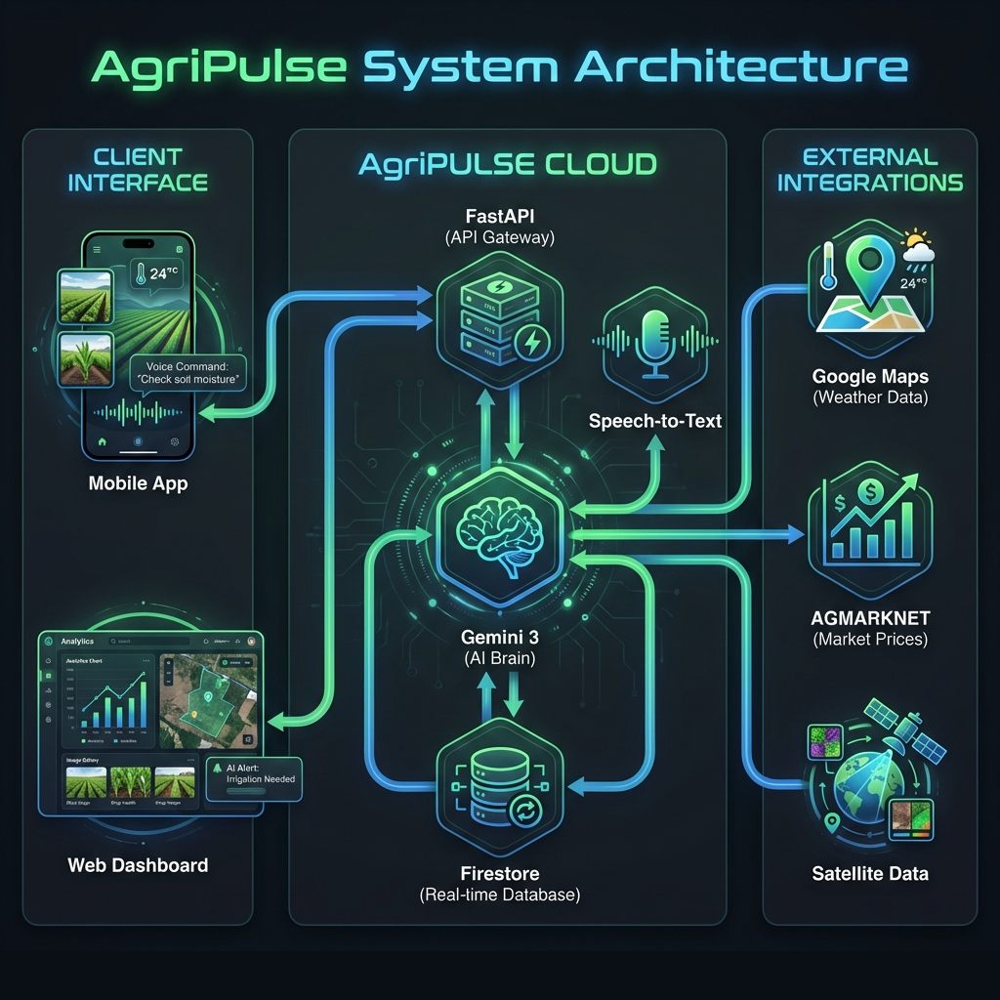
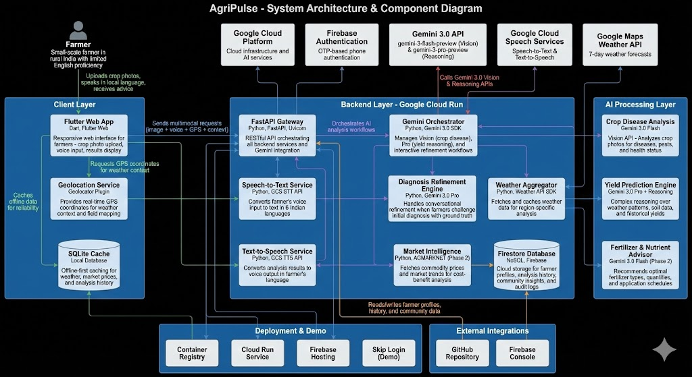

# AgriPulse 🌾

**AI-Powered Agricultural Advisory Platform for Sustainable Farming**

[](LICENSE)
[](https://github.com/NarayanababuRaju/AgriPulse)
[](https://gemini3.devpost.com/)

---

## 🎯 Vision

AgriPulse empowers small-scale farmers in rural India to make **data-driven agricultural decisions** using **Google's Gemini 3.0 AI**, combining:

- 📸 **Crop image analysis** for disease and pest detection
- 🗣️ **Voice input/output** in 6 Indian languages (Tamil, Telugu, Kannada, Malayalam, Hindi, English)
- 🌤️ **Weather-aware recommendations** based on real-time forecasts
- 📊 **Yield prediction** using advanced AI reasoning
- 💰 **Cost-benefit analysis** for treatment decisions

---

## 🚀 Live Demo
**Application URL**: [https://agri-pulse-firebase.web.app](https://agri-pulse-firebase.web.app)  
**Demo Video**: [Watch the Project Walkthrough](https://youtu.be/y7ltx-xm-vg)

---

### 🧪 Testing the Demo

**For Judges & Evaluators:**  
We've provided sample crop disease images to test the AI Crop Doctor feature:

**Sample Images:**
- [Basal Rot](data/raw/BasalRot) - Onion bulb disease
- [Downy Mildew](data/raw/DownyMildew) - Fungal leaf infection
- [Leaf Blight](data/raw/LeafBlight) - Common leaf disease
- [Purple Blotch](data/raw/PurpleBlotch) - Onion leaf spots
- [Pythium Root Rot](data/raw/PythiumRootRot) - Root system disease
- [Smut](data/raw/Smut) - Fungal disease
- [White Rot](data/raw/WhiteRot) - Soil-borne disease

**How to Test:**
1. Visit [https://agri-pulse-firebase.web.app](https://agri-pulse-firebase.web.app)
2. Click **"Skip Login (Demo Mode)"** on the login screen
3. Navigate to **"Crop Doctor"** from the dashboard
4. Upload one of the sample images from the links above
5. Describe symptoms via voice or text (optional)
6. View the AI-generated diagnosis and treatment plan in seconds

---

## ✨ Key Features (MVP)

### 🚀 Core Intelligence (Demo Ready)
- **🦠 AI Crop Doctor**: Instant crop disease diagnosis using Gemini 3.0 Vision. Upload photos, describe symptoms, and get treatment plans in your local language.
- **📊 Yield Prediction Engine**: Advanced reasoning-based yield estimation considering weather patterns, soil inputs, and historical context.
- **🌤️ Hyper-Local Weather**: Real-time location-based weather data integrated into every analysis step via browser geolocation.
- **🗣️ Vernacular Voice UI**: Full voice interaction support in **6 Indian languages** (Tamil, Telugu, Kannada, Malayalam, Hindi, English).
- **📅 Field Cycle Management**: Track multiple plots and crop cycles with personalized advice for each growth stage.

### 🛠️ Coming Soon (Expansion Phase)
- **⏳ Soil Health Time Machine**: Historical soil analysis and trend tracking.
- **🧪 Fertilizer & Nutrient Advisor**: Get optimal fertilizer recommendations (type, quantity, timing) with organic and chemical alternatives tailored to your soil and weather conditions.
- **📈 Market Intelligence**: Real-time commodity price tracking and profit-benefit analysis.
- **💧 Smart Irrigation**: Automated irrigation scheduling based on soil moisture sensors and weather forecasts.
- **♻️ Sustainable Farming Advisor**: Receive recommendations for organic alternatives, climate-resilient practices, and environmentally friendly farming methods.
- **🏛️ Gov-Scheme Matcher**: Automated subsidy and scheme identification based on farmer profile.
- **🎙️ Voice Command Center**: Complete hands-free app navigation for field usage.

---

## 🏗️ System Architecture






---

## 📁 Project Structure

AgriPulse follows a modular, feature-first architecture to ensure scalability across platforms.

```text

AgriPulse/
├── backend/                          # Python FastAPI Backend
│   ├── app/
│   │   ├── api/                      # Route handlers (auth, diagnosis, yield)
│   │   ├── services/                 # AI logic (Gemini, STT/TTS, Weather)
│   │   ├── db/                       # Firestore repository patterns
│   │   └── main.py                   # Application entry point
│   └── tests/                        # E2E and Unit test suite
├── flutter_app/                      # Flutter Web Frontend
│   ├── lib/
│   │   ├── core/                     # Routing, Localization, Theme, Widgets
│   │   └── features/                 # Feature-driven UI:
│   │       ├── auth/                 # OTP Login & Demo Bypass
│   │       ├── crop_diagnosis/       # Image analysis & AI Chat
│   │       ├── dashboard/            # Pane-based Command Center
│   │       └── yield_prediction/     # Estimator & Results Display
│   └── web/                          # Web-specific configurations
├── data/                             # Sample Data & Assets
│   └── raw/                          # Sample crop disease images for testing
│       ├── BasalRot/                 # Onion bulb disease samples
│       ├── DownyMildew/              # Fungal leaf infection samples
│       ├── LeafBlight/               # Common leaf disease samples
│       ├── PurpleBlotch/             # Onion leaf spot samples
│       ├── PythiumRootRot/           # Root system disease samples
│       ├── Smut/                     # Fungal disease samples
│       └── WhiteRot/                 # Soil-borne disease samples
└── docs/                             # Specifications and Architecture

```

---

## 🛠️ Technology Stack

### Frontend
- **Framework**: Flutter Web (Multi-pane Responsive Design)
- **State Management**: Riverpod (Reactive state & caching)
- **Navigation**: `go_router` (Declarative routing)
- **Networking**: `dio` (Centralized API client)
- **Services**: `geolocator` (Live weather context), `speech_to_text` (Vernacular input)
- **Animations**: `flutter_animate`, `shimmer` (High-density visual polish)

### Backend
- **Framework**: FastAPI (Asynchronous Python Gateway)
- **Database**: Google Cloud Firestore (Real-time NoSQL)
- **Hosting**: Firebase Hosting (Frontend) & Google Cloud Run (Backend - Auto-scaling serverless)
- **Environment**: Pydantic v2 (Data validation)

### AI & Intelligence
- **Multimodal AI**: Gemini 3.0 Flash & Pro (Vision + Reasoning)
- **Speech**: Google Cloud STT & TTS (6 vernacular Indian languages)
- **Context**: OpenWeatherMap (Real-time data injection)
- **Primary Model**: Gemini 3.0 Flash Preview (vision analysis, fast inference)
- **Reasoning Model**: Gemini 3.0 Pro Preview (yield prediction, complex reasoning)
- **Hyper-Context**: Real-time integration of Weather, Location, and Plot History into AI Prompts.
- **SDK Version**: google-generativeai 0.8.6
- **Capabilities**: Vision API, text generation, reasoning mode, multimodal analysis
- **Status**: ✅ Fully integrated and tested with real onion disease images

### Data & Storage
- **Primary Database**: Firestore (NoSQL, real-time sync)
- **Local Cache**: SQLite (offline-first strategy)
- **File Storage**: Google Cloud Storage (crop images)

### APIs & Services
- **Speech**: Google Cloud Speech-to-Text & Text-to-Speech (6 Indian languages)
- **Weather**: OpenWeatherAPI/Google Maps Platform Weather API (7-day forecasts)
- **Authentication**: Firebase Auth (OTP-based phone verification)
- **Market Data**: AGMARKNET API (Phase 2, currently mocked)

### Infrastructure
- **Containerization**: Docker (Multi-stage builds)
- **Cloud Provider**: Google Cloud Platform (Cloud Run, Firestore, Cloud Storage)
- **Security**: Firebase Auth (Phone/OTP flow)
- **Version Control**: Git / GitHub Actions

---

## 📂 Documentation Iceberg

Navigate through the technical specifics of AgriPulse using the links below.

### 🏛️ Architecture & Core Design
- [**System Architecture (C4)**](docs/SYSTEM_ARCHITECTURE_C4.md) - Deep dive into component interaction.
- [**Features & Requirements**](docs/FEATURES_AND_REQUIREMENTS.md) - The complete product roadmap.
- [**Gemini Integration**](docs/GEMINI_INTEGRATION_WRITEUP.md) - How we utilize multimodal reasoning.

### 🏁 Milestone Reports
- [**Milestone v1**](docs/milestones/v1_agripulse_locked.md) - Initialization & Foundation.
- [**Milestone v2**](docs/milestones/v2_agripulse_backend_complete.md) - Intelligence & Backend.
- [**Milestone v3**](docs/milestones/v3_basic_feature_working.md) - Full-stack Integration & Stability.


---

## 🎓 Gemini 3.0 Integration

AgriPulse leverages **Google's Gemini 3.0** models for intelligent agricultural insights:

### Gemini 3.0 Flash (Fast Analysis)
- **Use Cases**: Crop disease detection, fertilizer recommendations, image analysis
- **Speed**: Real-time inference (< 2 seconds)
- **Cost**: Optimized for frequent API calls
- **Vision Capabilities**: Analyzes crop photos for diseases, pests, health status

### Gemini 3.0 Pro (Advanced Reasoning)
- **Use Cases**: Yield prediction, complex reasoning over historical data, climate analysis
- **Capability**: Reasoning mode for multi-step problem solving
- **Accuracy**: High-precision predictions combining multiple data sources

---

## 🌍 Language Support

AgriPulse supports farmers in their native languages:
- 🇮🇳 **Tamil** (தமிழ்)
- 🇮🇳 **Telugu** (తెలుగు)
- 🇮🇳 **Kannada** (ಕನ್ನಡ)
- 🇮🇳 **Malayalam** (മലയാളം)
- 🇮🇳 **Hindi** (हिंदी)
- 🇬🇧 **English**

All voice input/output and responses are automatically localized using Google Cloud Speech services.

---

## 🚀 Quick Start

### Prerequisites
- Flutter SDK (latest)
- Python 3.10+
- Google Cloud Account (GCP)
- Firebase Project

### Local Development

1. **Clone the repository**
```bash
git clone https://github.com/NarayanababuRaju/AgriPulse.git
cd AgriPulse
```

2. **Setup Flutter Web**
```bash
cd flutter_app
flutter pub get
flutter run -d web
```

3. **Setup Python Backend**
```bash
cd backend
python -m venv venv
source venv/bin/activate  # On Windows: venv\Scripts\activate
pip install -r requirements.txt

# Start the server
./start_server.sh
# OR
uvicorn app.main:app --host 127.0.0.1 --port 8080 --reload
```

**Test the API (Backend Only):**
```bash
# Verify Gemini & Weather Connectivity
curl http://localhost:8080/api/v1/diagnosis/health

# Trigger a Mock Analysis 
curl -X POST http://localhost:8080/api/v1/diagnosis/analyze \
     -H "Content-Type: application/json" \
     -d '{"description": "yellowing leaves", "soil_type": "loamy"}'
```

4. **Configure Environment Variables**
   - Copy `.env.example` to `.env`
   - Add your API keys:
     ```bash
     GEMINI_API_KEY=your_gemini_api_key_here
     WEATHER_API_KEY=your_weather_api_key_here
     ```
   - Set GCP credentials path:
     ```bash
     GOOGLE_APPLICATION_CREDENTIALS=config/service-account.json
     ```

5. **Setup Google Cloud & Firebase**
   - Follow [Google Cloud Setup Guide](docs/google_cloud_setup_guide.md)
   - Follow [Firebase Setup Guide](docs/firebase_setup_guide.md)
   - Create Firestore database in asia-south1
   - Download service account JSON to `backend/config/`

---

## 📝 License

This project is licensed under the **MIT License** - see [LICENSE](LICENSE) file for details.

---

## 👤 Author

**Narayana Babu Raju**
- GitHub: [@NarayanababuRaju](https://github.com/NarayanababuRaju)
- LinkedIn: [narayanababu-raju](https://www.linkedin.com/in/narayanababu-raju/)

---

## 🎯 Hackathon Info

- **Event**: Google DeepMind Gemini 3 Hackathon
- **Duration**: December 17, 2025 - February 9, 2026
- **Challenge**: Build innovative solutions using Gemini 3.0 APIs
- **Repository**: [AgriPulse GitHub](https://github.com/NarayanababuRaju/AgriPulse)

---


## ✅ Current Status

### Completed Features:
- ✅ **Backend API**: FastAPI server with Gemini 3.0 integration
- ✅ **Intelligence Bridge**:
    - **Speech APIs**: Google Cloud STT/TTS (6 Languages)
    - **Weather Context**: Real-time injection via OpenWeatherMap
- ✅ **Crop Disease Analysis**: Multimodal analysis with gemini-3-flash-preview
- ✅ **Yield Prediction**: Reasoning-based predictions with gemini-3-pro-preview
- ✅ **Financial Modeling**: Cost-benefit analysis & ROI calculator
- ✅ **Firestore Integration**: Database operations fully functional
- ✅ **Flutter Web Frontend**: 
    - **Auth**: Secure Phone/OTP flow with Firebase
    - **Dashboard**: Weather-aware command center with glassmorphic UI
    - **Crop Doctor**: Integrated Multimodal diagnosis & TTS playback
    - **Yield Estimator**: Interactive forms with financial charts
    - **Localization**: Full support for 6 Indian languages
    - ✅ **Testing**: All API endpoints tested (34/34 passing)
- ✅ **Real-World Validation**: Successfully analyzed actual onion disease images
  - Basal Rot: 95% confidence
  - Pythium Root Rot: 92% confidence
  - Purple Blotch: 85% confidence
- ✅ **Milestone v3**: "Working System" fully verified and integrated
- ✅ **Testing**: Unit & Integration tests for Backend (FastAPI) and Frontend (Riverpod)

### In Progress:
- 🔄 **Feature Expansion**: Adding expert-connect and community forum modules.
- 🔄 **Analytics Dashboard**: Deep-dive historical yield trends.

### Completed:
- ✅ **Mobile Optimization**: Verified responsive layouts on mobile devices.
- ✅ **Demo Video**: Final hackathon showcase video completed.
- ✅ **Production Deployment**: Live on Firebase Hosting.

---

*Date Created: January 26, 2026*
*Last Updated: February 9, 2026*

---
