# AgriPulse 🌾

**AI-Powered Agricultural Advisory Platform for Sustainable Farming**

[](LICENSE)
[](https://github.com/NarayanababuRaju/AgriPulse)
[](https://gemini3.devpost.com/)

---

## 🎯 Vision

AgriPulse empowers small-scale farmers in rural India to make **data-driven agricultural decisions** using **Google's Gemini 3.0 AI**, combining:

- 📸 **Crop image analysis** for disease and pest detection
- 🗣️ **Voice input/output** in 6 Indian languages (Tamil, Telugu, Kannada, Malayalam, Hindi, English)
- 🌤️ **Weather-aware recommendations** based on real-time forecasts
- 📊 **Yield prediction** using advanced AI reasoning
- 💰 **Cost-benefit analysis** for treatment decisions
- 🏛️ **Government scheme matching** for subsidies and financial support
- ♻️ **Sustainable farming practices** for eco-friendly agriculture

---

## ✨ Key Features (MVP)

### 1. 🦠 Crop Disease & Health Analysis
Upload crop photos and describe symptoms in your local language. AgriPulse identifies diseases/pests and recommends sustainable treatments with cost-benefit analysis.

### 2. 🧪 Fertilizer & Nutrient Advisor
Get optimal fertilizer recommendations (type, quantity, timing) with organic and chemical alternatives tailored to your soil and weather conditions.

### 3. 📈 Yield Prediction Engine
Predict expected crop yield based on weather patterns, soil health, treatments applied, and historical data using advanced AI reasoning.

### 4. ♻️ Sustainable Farming Advisor
Receive recommendations for organic alternatives, climate-resilient practices, and environmentally friendly farming methods.

### 5. 🏛️ Government Schemes Finder
Discover applicable government subsidies, loan schemes, and support programs specific to your crop and region.

---

## 🏗️ System Architecture

```mermaid
C4Container
    title AgriPulse - System Architecture & Component Diagram

    Person(farmer, "Farmer", "Small-scale farmer in rural India with limited English proficiency")

    System_Ext(googleCloud, "Google Cloud Platform", "Cloud infrastructure and AI services")
    System_Ext(firebaseAuth, "Firebase Authentication", "OTP-based phone authentication")
    System_Ext(geminiAPI, "Gemini 3.0 API", "Vision & Reasoning AI models")
    System_Ext(speechAPIs, "Google Cloud Speech Services", "Speech-to-Text & Text-to-Speech")
    System_Ext(weatherAPI, "Google Maps Weather API", "7-day weather forecasts")

    Container_Boundary(client, "Client Layer") {
        Container(flutterWeb, "Flutter Web App", "Dart, Flutter Web", "Responsive web interface for farmers - crop photo upload, voice input, results display")
        ContainerDb(sqlite, "SQLite Cache", "Local Database", "Offline-first caching for weather, market prices, and analysis history")
    }

    Container_Boundary(backend, "Backend Layer - Google Cloud Run") {
        Container(fastAPI, "FastAPI Gateway", "Python, FastAPI, Uvicorn", "RESTful API orchestrating all backend services and Gemini integration")
        Container(sttService, "Speech-to-Text Service", "Python, GCS STT API", "Converts farmer's voice input to text in 6 Indian languages")
        Container(ttsService, "Text-to-Speech Service", "Python, GCS TTS API", "Converts analysis results to voice output in farmer's language")
        Container(geminiOrch, "Gemini Orchestrator", "Python, Gemini 3.0 SDK", "Manages Vision (crop disease), Pro (yield reasoning), and reasoning workflows")
        Container(weatherService, "Weather Aggregator", "Python, Weather API SDK", "Fetches and caches weather data for region-specific analysis")
        Container(marketService, "Market Intelligence", "Python, AGMARKNET (Phase 2)", "Fetches commodity prices and market trends for cost-benefit analysis")
        ContainerDb(firestoreDB, "Firestore Database", "NoSQL, Firebase", "Cloud storage for farmer profiles, analysis history, community insights, and audit logs")
    }

    Container_Boundary(processing, "AI Processing Layer") {
        Container(cropAnalysis, "Crop Disease Analysis", "Gemini 3.0 Flash", "Vision API - Analyzes crop photos for diseases, pests, and health status")
        Container(yieldPrediction, "Yield Prediction Engine", "Gemini 3.0 Pro + Reasoning", "Complex reasoning over weather patterns, soil data, and historical yields")
        Container(fertilizerAdvisor, "Fertilizer & Nutrient Advisor", "Gemini 3.0 Flash", "Recommends optimal fertilizer types, quantities, and application schedules")
        Container(sustainableFarming, "Sustainable Farming Advisor", "Gemini 3.0 Pro", "Recommends organic alternatives and climate-resilient practices")
        Container(governmentSchemes, "Government Schemes Finder", "Gemini 3.0 Flash + Database", "Matches farmers with applicable subsidies and government schemes")
    }

    Container_Boundary(deployment, "Deployment & Demo") {
        Container(containerRegistry, "Container Registry", "Google Cloud Build", "Containerized FastAPI backend (Docker)")
        Container(cloudRun, "Cloud Run Service", "Serverless Container Hosting", "Auto-scaling FastAPI backend with CORS enabled for Flutter Web")
        Container(demoInstance, "Demo Web Instance", "Cloud Run", "Public-facing Flask/Streamlit demo for hackathon judges")
    }

    Container_Boundary(integration, "External Integrations") {
        ContainerDb(github, "GitHub Repository", "Version Control", "Source code, documentation, and deployment pipelines")
        ContainerDb(firebaseConsole, "Firebase Console", "Project Management", "Firestore database management, Auth configuration")
    }

    Rel(farmer, flutterWeb, "Uploads crop photos, speaks in local language, receives advice", "HTTPS/WebSocket")
    Rel(flutterWeb, sqlite, "Caches offline data for reliability")
    Rel(flutterWeb, fastAPI, "Sends multimodal requests (image + voice + context)", "REST API, JSON/HTTPS")
    
    Rel(fastAPI, sttService, "Sends voice audio for transcription")
    Rel(sttService, fastAPI, "Returns transcribed text in selected language")
    Rel(fastAPI, geminiOrch, "Orchestrates AI analysis workflows")
    
    Rel(geminiOrch, cropAnalysis, "Routes crop photos for disease analysis")
    Rel(geminiOrch, yieldPrediction, "Routes data for yield prediction reasoning")
    Rel(geminiOrch, fertilizerAdvisor, "Routes soil/crop data for fertilizer recommendations")
    Rel(geminiOrch, sustainableFarming, "Routes context for organic alternatives")
    Rel(geminiOrch, governmentSchemes, "Routes farmer profile for scheme matching")
    
    Rel(geminiOrch, geminiAPI, "Calls Gemini 3.0 Vision & Reasoning APIs")
    Rel(fastAPI, weatherService, "Requests weather data for analysis context")
    Rel(weatherService, weatherAPI, "Fetches live weather forecasts")
    Rel(fastAPI, marketService, "Requests market prices for cost-benefit")
    
    Rel(fastAPI, firestoreDB, "Reads/writes farmer profiles, history, and community data")
    Rel(fastAPI, ttsService, "Sends analysis results for voice synthesis")
    Rel(ttsService, fastAPI, "Returns audio response for farmer")
    
    Rel(fastAPI, firebaseAuth, "Validates OTP for farmer authentication")
    
    Rel(fastAPI, cloudRun, "Deployed as containerized service")
    Rel(demoInstance, flutterWeb, "Hosts public demo for judges")
    
    Rel(github, fastAPI, "Hosts source code and CI/CD")
    Rel(firebaseConsole, firestoreDB, "Manages database structure and rules")

    UpdateRelStyle(farmer, flutterWeb, $textColor="green", $lineColor="green", $offsetY="-30")
    UpdateRelStyle(flutterWeb, fastAPI, $textColor="blue", $lineColor="blue", $offsetY="-40")
    UpdateRelStyle(fastAPI, geminiOrch, $textColor="purple", $lineColor="purple")
    UpdateRelStyle(geminiOrch, geminiAPI, $textColor="red", $lineColor="red", $offsetY="-50")
    UpdateRelStyle(fastAPI, firestoreDB, $textColor="orange", $lineColor="orange", $offsetX="50")
    UpdateRelStyle(fastAPI, cloudRun, $textColor="darkgreen", $lineColor="darkgreen", $offsetY="30")
```





**View detailed architecture documentation**: [SYSTEM_ARCHITECTURE_C4.md](docs/SYSTEM_ARCHITECTURE_C4.md)

---

## 📁 Project Structure

AgriPulse follows a modular, feature-first architecture to ensure scalability across platforms.

```text
AgriPulse/
├── backend/            # Python FastAPI backend
│   ├── app/            # Core API, services, and models
│   └── tests/          # Pytest suite for end-to-end verification
├── flutter_app/        # Flutter Web/Mobile frontend
│   ├── lib/
│   │   ├── core/       # Shared themes, routing, and networking
│   │   └── features/   # Business modules (Auth, Diagnosis, Dashboard)
│   └── test/           # Unit, widget, and integration tests
└── docs/               # Technical documentation & milestones
```

---

---

## 🛠️ Technology Stack

### Frontend
- **Framework**: Flutter Web (Dart)
- **Features**: Responsive design, offline-first, real-time updates
- **Libraries**: Riverpod, Dio, Hive, Firebase, Speech APIs
    - **State Management**: Riverpod (Reactive provider engine)
- **Networking**: `dio` (Centralized API Client)
- **Audio**: `just_audio` (Web Data-URI bridge for binary streams)
- **Visuals**: `google_fonts` (Outfit/Inter), `flutter_animate`, `shimmer`

### Backend
- **Framework**: FastAPI 0.104.1 (Async orchestration)
- **Server**: Uvicorn (ASGI server)
- **Deployment**: Google Cloud Run (serverless, auto-scaling) - *Planned*
- **Features**: High-performance async API, CORS enabled for web clients
- **Database**: Firestore (`agri-pulse-firestore-db`, asia-south1)
- **Cloud Service**: Google Cloud Run (Auto-scaling serverless)

### AI & Intelligence
- **Multimodal AI**: Gemini 3.0 Flash & Pro (Vision + Reasoning)
- **Speech**: Google Cloud STT & TTS (6 vernacular Indian languages)
- **Context**: OpenWeatherMap (Real-time data injection)
- **Primary Model**: Gemini 3.0 Flash Preview (vision analysis, fast inference)
- **Reasoning Model**: Gemini 3.0 Pro Preview (yield prediction, complex reasoning)
- **SDK Version**: google-generativeai 0.8.6
- **Capabilities**: Vision API, text generation, reasoning mode, multimodal analysis
- **Status**: ✅ Fully integrated and tested with real onion disease images

### Data & Storage
- **Primary Database**: Firestore (NoSQL, real-time sync)
- **Local Cache**: SQLite (offline-first strategy)
- **File Storage**: Google Cloud Storage (crop images)

### APIs & Services
- **Speech**: Google Cloud Speech-to-Text & Text-to-Speech (6 Indian languages)
- **Weather**: Google Maps Platform Weather API (7-day forecasts)
- **Authentication**: Firebase Auth (OTP-based phone verification)
- **Market Data**: AGMARKNET API (Phase 2, currently mocked)

### Infrastructure
- **Containerization**: Docker (Multi-stage builds)
- **Cloud Provider**: Google Cloud Platform (Cloud Run, Firestore, Cloud Storage)
- **Security**: Firebase Auth (Phone/OTP flow)
- **Version Control**: Git / GitHub Actions

---

## 📂 Documentation Iceberg

Navigate through the technical specifics of AgriPulse using the links below.

### 🏛️ Architecture & Core Design
- [**System Architecture (C4)**](docs/SYSTEM_ARCHITECTURE_C4.md) - Deep dive into component interaction.
- [**Features & Requirements**](docs/FEATURES_AND_REQUIREMENTS.md) - The complete product roadmap.
- [**Gemini Integration**](docs/GEMINI_INTEGRATION_WRITEUP.md) - How we utilize multimodal reasoning.

### 🏁 Milestone Reports
- [**Milestone v1**](docs/milestones/v1_agripulse_locked.md) - Initialization & Foundation.
- [**Milestone v2**](docs/milestones/v2_agripulse_backend_complete.md) - Intelligence & Backend.
- [**Milestone v3**](docs/milestones/v3_basic_feature_working.md) - Full-stack Integration & Stability.


---

## 🎓 Gemini 3.0 Integration

AgriPulse leverages **Google's Gemini 3.0** models for intelligent agricultural insights:

### Gemini 3.0 Flash (Fast Analysis)
- **Use Cases**: Crop disease detection, fertilizer recommendations, image analysis
- **Speed**: Real-time inference (< 2 seconds)
- **Cost**: Optimized for frequent API calls
- **Vision Capabilities**: Analyzes crop photos for diseases, pests, health status

### Gemini 3.0 Pro (Advanced Reasoning)
- **Use Cases**: Yield prediction, complex reasoning over historical data, climate analysis
- **Capability**: Reasoning mode for multi-step problem solving
- **Accuracy**: High-precision predictions combining multiple data sources

---

## 🌍 Language Support

AgriPulse supports farmers in their native languages:
- 🇮🇳 **Tamil** (தமிழ்)
- 🇮🇳 **Telugu** (తెలుగు)
- 🇮🇳 **Kannada** (ಕನ್ನಡ)
- 🇮🇳 **Malayalam** (മലയാളം)
- 🇮🇳 **Hindi** (हिंदी)
- 🇬🇧 **English**

All voice input/output and responses are automatically localized using Google Cloud Speech services.

---

## 🚀 Quick Start

### Prerequisites
- Flutter SDK (latest)
- Python 3.10+
- Google Cloud Account (GCP)
- Firebase Project

### Local Development

1. **Clone the repository**
```bash
git clone https://github.com/NarayanababuRaju/AgriPulse.git
cd AgriPulse
```

2. **Setup Flutter Web**
```bash
cd flutter_app
flutter pub get
flutter run -d web
```

3. **Setup Python Backend**
```bash
cd backend
python -m venv venv
source venv/bin/activate  # On Windows: venv\Scripts\activate
pip install -r requirements.txt

# Start the server
./start_server.sh
# OR
uvicorn app.main:app --host 127.0.0.1 --port 8080 --reload
```

**Test the API:**
```bash
# Interactive API docs
open http://127.0.0.1:8080/docs

# Run test suite
python tests/test_api.py

# Test with real disease images
python tests/test_real_images.py

# Check available Gemini models
python tests/check_models.py
```

4. **Configure Environment Variables**
   - Copy `.env.example` to `.env`
   - Add your API keys:
     ```bash
     GEMINI_API_KEY=your_gemini_api_key_here
     WEATHER_API_KEY=your_weather_api_key_here
     ```
   - Set GCP credentials path:
     ```bash
     GOOGLE_APPLICATION_CREDENTIALS=config/service-account.json
     ```

5. **Setup Google Cloud & Firebase**
   - Follow [Google Cloud Setup Guide](docs/google_cloud_setup_guide.md)
   - Follow [Firebase Setup Guide](docs/firebase_setup_guide.md)
   - Create Firestore database in asia-south1
   - Download service account JSON to `backend/config/`

---

## 📝 License

This project is licensed under the **MIT License** - see [LICENSE](LICENSE) file for details.

---

## 👤 Author

**Narayana Babu Raju**
- GitHub: [@NarayanababuRaju](https://github.com/NarayanababuRaju)
- LinkedIn: [narayanababu-raju](https://www.linkedin.com/in/narayanababu-raju/)

---

## 🎯 Hackathon Info

- **Event**: Google DeepMind Gemini 3 Hackathon
- **Duration**: December 17, 2025 - February 9, 2026
- **Challenge**: Build innovative solutions using Gemini 3.0 APIs
- **Repository**: [AgriPulse GitHub](https://github.com/NarayanababuRaju/AgriPulse)

---

---

## ✅ Current Status

### Completed Features:
- ✅ **Backend API**: FastAPI server with Gemini 3.0 integration
- ✅ **Intelligence Bridge**:
    - **Speech APIs**: Google Cloud STT/TTS (6 Languages)
    - **Weather Context**: Real-time injection via OpenWeatherMap
- ✅ **Crop Disease Analysis**: Multimodal analysis with gemini-3-flash-preview
- ✅ **Yield Prediction**: Reasoning-based predictions with gemini-3-pro-preview
- ✅ **Firestore Integration**: Database operations fully functional
- ✅ **Flutter Web Frontend**: 
    - **Auth**: Secure Phone/OTP flow with Firebase
    - **Dashboard**: Weather-aware command center with glassmorphic UI
    - **Crop Doctor**: Integrated Multimodal diagnosis & TTS playback
    - ✅ **Testing**: All API endpoints tested (3/3 passing)
- ✅ **Real-World Validation**: Successfully analyzed actual onion disease images
  - Basal Rot: 95% confidence
  - Pythium Root Rot: 92% confidence
  - Purple Blotch: 85% confidence
- ✅ **Milestone v3**: "Working System" fully verified and integrated
- ✅ **Testing**: Unit & Integration tests for Backend (FastAPI) and Frontend (Riverpod)

### In Progress (Phase 2):
- 🔄 **Cloud Deployment**: Deploying backend services to Google Cloud Run
- 🔄 **Yield Estimation UI**: Interactive inputs for Phase 2 reasoning
- 🔄 **Cost-Benefit Calculator**: Financial modeling for farmers

### Upcoming:
- ⏳ **Mobile Testing**: Optimizing for Android and iOS devices
- ⏳ **Demo Video**: Creating the final hackathon showcase video

---

*Date Created: December 17, 2025*
*Last Updated: January 31, 2026*

---
