# AgriPulse 🌾

**AI-Powered Agricultural Advisory Platform for Sustainable Farming**

[](LICENSE)
[](https://github.com/NarayanababuRaju/AgriPulse)
[](https://www.googlecloud.com/blog/gemini-hackathon)

---

## 🎯 Vision

AgriPulse empowers small-scale farmers in rural India to make **data-driven agricultural decisions** using **Google's Gemini 3.0 AI**, combining:

- 📸 **Crop image analysis** for disease and pest detection
- 🗣️ **Voice input/output** in 6 Indian languages (Tamil, Telugu, Kannada, Malayalam, Hindi, English)
- 🌤️ **Weather-aware recommendations** based on real-time forecasts
- 📊 **Yield prediction** using advanced AI reasoning
- 💰 **Cost-benefit analysis** for treatment decisions
- 🏛️ **Government scheme matching** for subsidies and financial support
- ♻️ **Sustainable farming practices** for eco-friendly agriculture

---

## ✨ Key Features (MVP)

### 1. 🦠 Crop Disease & Health Analysis
Upload crop photos and describe symptoms in your local language. AgriPulse identifies diseases/pests and recommends sustainable treatments with cost-benefit analysis.

### 2. 🧪 Fertilizer & Nutrient Advisor
Get optimal fertilizer recommendations (type, quantity, timing) with organic and chemical alternatives tailored to your soil and weather conditions.

### 3. 📈 Yield Prediction Engine
Predict expected crop yield based on weather patterns, soil health, treatments applied, and historical data using advanced AI reasoning.

### 4. ♻️ Sustainable Farming Advisor
Receive recommendations for organic alternatives, climate-resilient practices, and environmentally friendly farming methods.

### 5. 🏛️ Government Schemes Finder
Discover applicable government subsidies, loan schemes, and support programs specific to your crop and region.

---

## 🏗️ System Architecture

```mermaid
C4Container
    title AgriPulse - System Architecture & Component Diagram

    Person(farmer, "Farmer", "Small-scale farmer in rural India with limited English proficiency")

    System_Ext(googleCloud, "Google Cloud Platform", "Cloud infrastructure and AI services")
    System_Ext(firebaseAuth, "Firebase Authentication", "OTP-based phone authentication")
    System_Ext(geminiAPI, "Gemini 3.0 API", "Vision & Reasoning AI models")
    System_Ext(speechAPIs, "Google Cloud Speech Services", "Speech-to-Text & Text-to-Speech")
    System_Ext(weatherAPI, "Google Maps Weather API", "7-day weather forecasts")

    Container_Boundary(client, "Client Layer") {
        Container(flutterWeb, "Flutter Web App", "Dart, Flutter Web", "Responsive web interface for farmers - crop photo upload, voice input, results display")
        ContainerDb(sqlite, "SQLite Cache", "Local Database", "Offline-first caching for weather, market prices, and analysis history")
    }

    Container_Boundary(backend, "Backend Layer - Google Cloud Run") {
        Container(fastAPI, "FastAPI Gateway", "Python, FastAPI, Uvicorn", "RESTful API orchestrating all backend services and Gemini integration")
        Container(sttService, "Speech-to-Text Service", "Python, GCS STT API", "Converts farmer's voice input to text in 6 Indian languages")
        Container(ttsService, "Text-to-Speech Service", "Python, GCS TTS API", "Converts analysis results to voice output in farmer's language")
        Container(geminiOrch, "Gemini Orchestrator", "Python, Gemini 3.0 SDK", "Manages Vision (crop disease), Pro (yield reasoning), and reasoning workflows")
        Container(weatherService, "Weather Aggregator", "Python, Weather API SDK", "Fetches and caches weather data for region-specific analysis")
        Container(marketService, "Market Intelligence", "Python, AGMARKNET (Phase 2)", "Fetches commodity prices and market trends for cost-benefit analysis")
        ContainerDb(firestoreDB, "Firestore Database", "NoSQL, Firebase", "Cloud storage for farmer profiles, analysis history, community insights, and audit logs")
    }

    Container_Boundary(processing, "AI Processing Layer") {
        Container(cropAnalysis, "Crop Disease Analysis", "Gemini 3.0 Flash", "Vision API - Analyzes crop photos for diseases, pests, and health status")
        Container(yieldPrediction, "Yield Prediction Engine", "Gemini 3.0 Pro + Reasoning", "Complex reasoning over weather patterns, soil data, and historical yields")
        Container(fertilizerAdvisor, "Fertilizer & Nutrient Advisor", "Gemini 3.0 Flash", "Recommends optimal fertilizer types, quantities, and application schedules")
        Container(sustainableFarming, "Sustainable Farming Advisor", "Gemini 3.0 Pro", "Recommends organic alternatives and climate-resilient practices")
        Container(governmentSchemes, "Government Schemes Finder", "Gemini 3.0 Flash + Database", "Matches farmers with applicable subsidies and government schemes")
    }

    Container_Boundary(deployment, "Deployment & Demo") {
        Container(containerRegistry, "Container Registry", "Google Cloud Build", "Containerized FastAPI backend (Docker)")
        Container(cloudRun, "Cloud Run Service", "Serverless Container Hosting", "Auto-scaling FastAPI backend with CORS enabled for Flutter Web")
        Container(demoInstance, "Demo Web Instance", "Cloud Run", "Public-facing Flask/Streamlit demo for hackathon judges")
    }

    Container_Boundary(integration, "External Integrations") {
        ContainerDb(github, "GitHub Repository", "Version Control", "Source code, documentation, and deployment pipelines")
        ContainerDb(firebaseConsole, "Firebase Console", "Project Management", "Firestore database management, Auth configuration")
    }

    Rel(farmer, flutterWeb, "Uploads crop photos, speaks in local language, receives advice", "HTTPS/WebSocket")
    Rel(flutterWeb, sqlite, "Caches offline data for reliability")
    Rel(flutterWeb, fastAPI, "Sends multimodal requests (image + voice + context)", "REST API, JSON/HTTPS")
    
    Rel(fastAPI, sttService, "Sends voice audio for transcription")
    Rel(sttService, fastAPI, "Returns transcribed text in selected language")
    Rel(fastAPI, geminiOrch, "Orchestrates AI analysis workflows")
    
    Rel(geminiOrch, cropAnalysis, "Routes crop photos for disease analysis")
    Rel(geminiOrch, yieldPrediction, "Routes data for yield prediction reasoning")
    Rel(geminiOrch, fertilizerAdvisor, "Routes soil/crop data for fertilizer recommendations")
    Rel(geminiOrch, sustainableFarming, "Routes context for organic alternatives")
    Rel(geminiOrch, governmentSchemes, "Routes farmer profile for scheme matching")
    
    Rel(geminiOrch, geminiAPI, "Calls Gemini 3.0 Vision & Reasoning APIs")
    Rel(fastAPI, weatherService, "Requests weather data for analysis context")
    Rel(weatherService, weatherAPI, "Fetches live weather forecasts")
    Rel(fastAPI, marketService, "Requests market prices for cost-benefit")
    
    Rel(fastAPI, firestoreDB, "Reads/writes farmer profiles, history, and community data")
    Rel(fastAPI, ttsService, "Sends analysis results for voice synthesis")
    Rel(ttsService, fastAPI, "Returns audio response for farmer")
    
    Rel(fastAPI, firebaseAuth, "Validates OTP for farmer authentication")
    
    Rel(fastAPI, cloudRun, "Deployed as containerized service")
    Rel(demoInstance, flutterWeb, "Hosts public demo for judges")
    
    Rel(github, fastAPI, "Hosts source code and CI/CD")
    Rel(firebaseConsole, firestoreDB, "Manages database structure and rules")

    UpdateRelStyle(farmer, flutterWeb, $textColor="green", $lineColor="green", $offsetY="-30")
    UpdateRelStyle(flutterWeb, fastAPI, $textColor="blue", $lineColor="blue", $offsetY="-40")
    UpdateRelStyle(fastAPI, geminiOrch, $textColor="purple", $lineColor="purple")
    UpdateRelStyle(geminiOrch, geminiAPI, $textColor="red", $lineColor="red", $offsetY="-50")
    UpdateRelStyle(fastAPI, firestoreDB, $textColor="orange", $lineColor="orange", $offsetX="50")
    UpdateRelStyle(fastAPI, cloudRun, $textColor="darkgreen", $lineColor="darkgreen", $offsetY="30")
```

### High-Resolution C4 Component Diagram




**View detailed architecture documentation**: [SYSTEM_ARCHITECTURE_C4.md](docs/SYSTEM_ARCHITECTURE_C4.md)

---

## 🛠️ Technology Stack

### Frontend
- **Framework**: Flutter Web (Dart)
- **Features**: Responsive design, offline-first, real-time updates
- **Libraries**: Riverpod, Dio, Hive, Firebase, Speech APIs

### Backend
- **Framework**: FastAPI (Python 3.10+)
- **Deployment**: Google Cloud Run (serverless, auto-scaling)
- **Features**: High-performance async API, CORS enabled for web clients

### AI & ML
- **Primary Model**: Gemini 3.0 Flash (vision analysis, fast inference)
- **Reasoning Model**: Gemini 3.0 Pro (yield prediction, complex reasoning)
- **Capabilities**: Vision API, text generation, reasoning mode, multimodal analysis

### Data & Storage
- **Primary Database**: Firestore (NoSQL, real-time sync)
- **Local Cache**: SQLite (offline-first strategy)
- **File Storage**: Google Cloud Storage (crop images)

### APIs & Services
- **Speech**: Google Cloud Speech-to-Text & Text-to-Speech (6 Indian languages)
- **Weather**: Google Maps Platform Weather API (7-day forecasts)
- **Authentication**: Firebase Auth (OTP-based phone verification)
- **Market Data**: AGMARKNET API (Phase 2, currently mocked)

### Infrastructure
- **Containerization**: Docker (FastAPI backend)
- **Cloud Provider**: Google Cloud Platform (Cloud Run, Firestore, Cloud Storage)
- **CI/CD**: GitHub Actions (automated testing and deployment)

---

## 📂 Documentation

For detailed technical information, please refer to the [docs](docs/) folder:
- **[System Architecture](docs/SYSTEM_ARCHITECTURE_C4.md)** - Detailed C4 component diagram and architecture explanation
- **[Features & Requirements](docs/FEATURES_AND_REQUIREMENTS.md)** - Complete feature specifications with acceptance criteria
- **[Gemini Integration](docs/GEMINI_INTEGRATION_WRITEUP.md)** - How Gemini 3.0 is integrated into AgriPulse
- **[Gemini API Knowledge Graph](docs/GEMINI_API_KNOWLEDGE_GRAPH.md)** - Complete Gemini API reference

---

## 🎓 Gemini 3.0 Integration

AgriPulse leverages **Google's Gemini 3.0** models for intelligent agricultural insights:

### Gemini 3.0 Flash (Fast Analysis)
- **Use Cases**: Crop disease detection, fertilizer recommendations, image analysis
- **Speed**: Real-time inference (< 2 seconds)
- **Cost**: Optimized for frequent API calls
- **Vision Capabilities**: Analyzes crop photos for diseases, pests, health status

### Gemini 3.0 Pro (Advanced Reasoning)
- **Use Cases**: Yield prediction, complex reasoning over historical data, climate analysis
- **Capability**: Reasoning mode for multi-step problem solving
- **Accuracy**: High-precision predictions combining multiple data sources

---

## 🌍 Language Support

AgriPulse supports farmers in their native languages:
- 🇮🇳 **Tamil** (தமிழ்)
- 🇮🇳 **Telugu** (తెలుగు)
- 🇮🇳 **Kannada** (ಕನ್ನಡ)
- 🇮🇳 **Malayalam** (മലയാളം)
- 🇮🇳 **Hindi** (हिंदी)
- 🇬🇧 **English**

All voice input/output and responses are automatically localized using Google Cloud Speech services.

---

## 🚀 Quick Start

### Prerequisites
- Flutter SDK (latest)
- Python 3.10+
- Google Cloud Account (GCP)
- Firebase Project

### Local Development

1. **Clone the repository**
```bash
git clone https://github.com/NarayanababuRaju/AgriPulse.git
cd AgriPulse
```

2. **Setup Flutter Web**
```bash
cd flutter_app
flutter pub get
flutter run -d web
```

3. **Setup Python Backend**
```bash
cd backend
python -m venv venv
source venv/bin/activate  # On Windows: venv\Scripts\activate
pip install -r requirements.txt
uvicorn app.main:app --reload
```

4. **Configure Firebase**
   - Create a Firebase project at [firebase.google.com](https://firebase.google.com)
   - Download `google-services.json` and place in `backend/config/`
   - Update Firestore security rules

5. **Setup Gemini API**
   - Enable Generative AI API in Google Cloud Console
   - Set `GEMINI_API_KEY` environment variable

---

## 📝 License

This project is licensed under the **MIT License** - see [LICENSE](LICENSE) file for details.

---

## 👤 Author

**Narayana Babu Raju**
- GitHub: [@NarayanababuRaju](https://github.com/NarayanababuRaju)
- LinkedIn: [narayanababu-raju](https://www.linkedin.com/in/narayanababu-raju/)

---

## 🎯 Hackathon Info

- **Event**: Google DeepMind Gemini 3 Hackathon
- **Duration**: December 17, 2025 - February 9, 2026
- **Challenge**: Build innovative solutions using Gemini 3.0 APIs
- **Repository**: [AgriPulse GitHub](https://github.com/NarayanababuRaju/AgriPulse)

---

*Last Updated: January 27, 2026*
*Status: Development (Day 1 Initialization)*
