# AgriPulse - System Architecture Diagram

## High-Resolution C4 Component Diagram

This diagram illustrates the complete AgriPulse system architecture, including all major components, layers, and external integrations.

```mermaid
C4Container
    title AgriPulse - System Architecture & Component Diagram

    Person(farmer, "Farmer", "Small-scale farmer in rural India with limited English proficiency")

    System_Ext(googleCloud, "Google Cloud Platform", "Cloud infrastructure and AI services")
    System_Ext(firebaseAuth, "Firebase Authentication", "OTP-based phone authentication")
    System_Ext(geminiAPI, "Gemini 3.0 API", "Vision & Reasoning AI models")
    System_Ext(speechAPIs, "Google Cloud Speech Services", "Speech-to-Text & Text-to-Speech")
    System_Ext(weatherAPI, "Google Maps Weather API", "7-day weather forecasts")

    Container_Boundary(client, "Client Layer") {
        Container(flutterWeb, "Flutter Web App", "Dart, Flutter Web", "Responsive web interface for farmers - crop photo upload, voice input, results display")
        ContainerDb(sqlite, "SQLite Cache", "Local Database", "Offline-first caching for weather, market prices, and analysis history")
    }

    Container_Boundary(backend, "Backend Layer - Google Cloud Run") {
        Container(fastAPI, "FastAPI Gateway", "Python, FastAPI, Uvicorn", "RESTful API orchestrating all backend services and Gemini integration")
        Container(sttService, "Speech-to-Text Service", "Python, GCS STT API", "Converts farmer's voice input to text in 6 Indian languages")
        Container(ttsService, "Text-to-Speech Service", "Python, GCS TTS API", "Converts analysis results to voice output in farmer's language")
        Container(geminiOrch, "Gemini Orchestrator", "Python, Gemini 3.0 SDK", "Manages Vision (crop disease), Pro (yield reasoning), and reasoning workflows")
        Container(weatherService, "Weather Aggregator", "Python, Weather API SDK", "Fetches and caches weather data for region-specific analysis")
        Container(marketService, "Market Intelligence", "Python, AGMARKNET (Phase 2)", "Fetches commodity prices and market trends for cost-benefit analysis")
        ContainerDb(firestoreDB, "Firestore Database", "NoSQL, Firebase", "Cloud storage for farmer profiles, analysis history, community insights, and audit logs")
    }

    Container_Boundary(processing, "AI Processing Layer") {
        Container(cropAnalysis, "Crop Disease Analysis", "Gemini 3.0 Flash", "Vision API - Analyzes crop photos for diseases, pests, and health status")
        Container(yieldPrediction, "Yield Prediction Engine", "Gemini 3.0 Pro + Reasoning", "Complex reasoning over weather patterns, soil data, and historical yields")
        Container(fertilizerAdvisor, "Fertilizer & Nutrient Advisor", "Gemini 3.0 Flash", "Recommends optimal fertilizer types, quantities, and application schedules")
        Container(sustainableFarming, "Sustainable Farming Advisor", "Gemini 3.0 Pro", "Recommends organic alternatives and climate-resilient practices")
        Container(governmentSchemes, "Government Schemes Finder", "Gemini 3.0 Flash + Database", "Matches farmers with applicable subsidies and government schemes")
    }

    Container_Boundary(deployment, "Deployment & Demo") {
        Container(containerRegistry, "Container Registry", "Google Cloud Build", "Containerized FastAPI backend (Docker)")
        Container(cloudRun, "Cloud Run Service", "Serverless Container Hosting", "Auto-scaling FastAPI backend with CORS enabled for Flutter Web")
        Container(demoInstance, "Demo Web Instance", "Cloud Run", "Public-facing Flask/Streamlit demo for hackathon judges")
    }

    Container_Boundary(integration, "External Integrations") {
        ContainerDb(github, "GitHub Repository", "Version Control", "Source code, documentation, and deployment pipelines")
        ContainerDb(firebaseConsole, "Firebase Console", "Project Management", "Firestore database management, Auth configuration")
    }

    Rel(farmer, flutterWeb, "Uploads crop photos, speaks in local language, receives advice", "HTTPS/WebSocket")
    Rel(flutterWeb, sqlite, "Caches offline data for reliability")
    Rel(flutterWeb, fastAPI, "Sends multimodal requests (image + voice + context)", "REST API, JSON/HTTPS")
    
    Rel(fastAPI, sttService, "Sends voice audio for transcription")
    Rel(sttService, fastAPI, "Returns transcribed text in selected language")
    Rel(fastAPI, geminiOrch, "Orchestrates AI analysis workflows")
    
    Rel(geminiOrch, cropAnalysis, "Routes crop photos for disease analysis")
    Rel(geminiOrch, yieldPrediction, "Routes data for yield prediction reasoning")
    Rel(geminiOrch, fertilizerAdvisor, "Routes soil/crop data for fertilizer recommendations")
    Rel(geminiOrch, sustainableFarming, "Routes context for organic alternatives")
    Rel(geminiOrch, governmentSchemes, "Routes farmer profile for scheme matching")
    
    Rel(geminiOrch, geminiAPI, "Calls Gemini 3.0 Vision & Reasoning APIs")
    Rel(fastAPI, weatherService, "Requests weather data for analysis context")
    Rel(weatherService, weatherAPI, "Fetches live weather forecasts")
    Rel(fastAPI, marketService, "Requests market prices for cost-benefit")
    
    Rel(fastAPI, firestoreDB, "Reads/writes farmer profiles, history, and community data")
    Rel(fastAPI, ttsService, "Sends analysis results for voice synthesis")
    Rel(ttsService, fastAPI, "Returns audio response for farmer")
    
    Rel(fastAPI, firebaseAuth, "Validates OTP for farmer authentication")
    
    Rel(fastAPI, cloudRun, "Deployed as containerized service")
    Rel(demoInstance, flutterWeb, "Hosts public demo for judges")
    
    Rel(github, fastAPI, "Hosts source code and CI/CD")
    Rel(firebaseConsole, firestoreDB, "Manages database structure and rules")

    UpdateRelStyle(farmer, flutterWeb, $textColor="green", $lineColor="green", $offsetY="-30")
    UpdateRelStyle(flutterWeb, fastAPI, $textColor="blue", $lineColor="blue", $offsetY="-40")
    UpdateRelStyle(fastAPI, geminiOrch, $textColor="purple", $lineColor="purple")
    UpdateRelStyle(geminiOrch, geminiAPI, $textColor="red", $lineColor="red", $offsetY="-50")
    UpdateRelStyle(fastAPI, firestoreDB, $textColor="orange", $lineColor="orange", $offsetX="50")
    UpdateRelStyle(fastAPI, cloudRun, $textColor="darkgreen", $lineColor="darkgreen", $offsetY="30")
```

---

## Architecture Layers

### 1. **Client Layer** 
- **Flutter Web App**: Responsive web interface with offline-first capabilities
- **SQLite Cache**: Local data storage for weather, market prices, and analysis history

### 2. **Backend Layer** (Google Cloud Run - Serverless)
- **FastAPI Gateway**: Central API orchestrator for all requests
- **Speech-to-Text Service**: Converts voice input to text in 6 Indian languages
- **Text-to-Speech Service**: Generates voice output in farmer's preferred language
- **Gemini Orchestrator**: Manages AI workflows and model coordination
- **Weather Aggregator**: Fetches and caches weather forecasts
- **Market Intelligence**: Provides commodity price data (Phase 2)
- **Firestore Database**: NoSQL cloud database for all persistent data

### 3. **AI Processing Layer**
- **Crop Disease Analysis** (Gemini 3.0 Flash): Vision API for image analysis
- **Yield Prediction Engine** (Gemini 3.0 Pro): Reasoning-based predictions
- **Fertilizer Advisor** (Gemini 3.0 Flash): Nutrient recommendations
- **Sustainable Farming Advisor** (Gemini 3.0 Pro): Organic alternatives
- **Government Schemes Finder**: Subsidy matching and scheme recommendations

### 4. **Deployment & Demo Layer**
- **Container Registry**: Docker image storage (Google Cloud Build)
- **Cloud Run Service**: Auto-scaling serverless backend deployment
- **Demo Web Instance**: Public-facing demo for hackathon judges

### 5. **External Integrations**
- **Google Cloud Platform**: Infrastructure, auth, AI services
- **Firebase Authentication**: OTP-based phone authentication
- **Gemini 3.0 API**: Vision and Reasoning model endpoints
- **Google Cloud Speech Services**: STT and TTS APIs
- **Google Maps Weather API**: Real-time weather data
- **GitHub**: Source code repository and CI/CD
- **Firebase Console**: Database management and configuration

---

## Data Flow Example: Crop Disease Analysis

1. **Farmer Input**: Uploads crop photo + speaks in local language (Tamil/Telugu/Kannada/Malayalam/Hindi)
2. **Client Processing**: Flutter Web app queues request, extracts GPS location, converts to offline-capable format
3. **Transmission**: Sends multimodal request (image + voice + context) to FastAPI Gateway via REST API
4. **Backend Processing**:
   - Speech-to-Text converts voice audio to text
   - Gemini Orchestrator receives image + transcribed text
   - Calls Gemini 3.0 Flash Vision API with crop image
   - Combines image analysis with textual symptoms
5. **Analysis**: Gemini returns disease identification with severity, treatment options, and cost-benefit breakdown
6. **Response Generation**:
   - Text-to-Speech converts analysis result to voice output
   - Formats response with visual annotations on crop image
7. **Delivery**: Sends multimodal response (text + voice + visual) back to farmer
8. **Caching**: Stores result in SQLite for offline access and Firestore for community insights

---

## Technology Stack Summary

| Component | Technology | Purpose |
|-----------|-----------|---------|
| Frontend | Flutter Web (Dart) | Cross-platform responsive UI |
| Backend API | FastAPI (Python) | High-performance async API |
| AI Models | Gemini 3.0 (Flash & Pro) | Vision analysis & reasoning |
| Speech | GCS STT/TTS | Multilingual voice I/O |
| Database | Firestore + SQLite | Cloud + local data storage |
| Deployment | Google Cloud Run | Serverless, auto-scaling containers |
| Auth | Firebase Auth | OTP-based phone authentication |
| Weather | Google Maps API | Weather forecasts & climate data |
| Version Control | GitHub | Source code & CI/CD |

---

## Gemini Model Usage

- **Gemini 3.0 Flash**: Real-time crop analysis, fertilizer recommendations (fast, cost-efficient)
- **Gemini 3.0 Pro**: Complex yield predictions, sustainable farming advice (advanced reasoning)

---

## Offline-First Strategy

AgriPulse is designed for low-connectivity environments:
- **Local Caching**: Weather forecasts and market prices cached in SQLite
- **Request Queuing**: Photo uploads and analysis requests queued locally
- **Auto Sync**: Data automatically syncs when stable connection is detected
- **UUID-based Records**: Client-side record creation with unique identifiers to avoid collisions

---

## Security & Data Privacy

- **Authentication**: OTP-based phone verification via Firebase Auth
- **Data Encryption**: All data in transit (HTTPS) and at rest (Cloud encryption)
- **Firestore Rules**: Row-level security for farmer data access
- **Image Processing**: Images processed on-the-fly, not permanently stored
- **API Rate Limiting**: Protection against abuse on FastAPI endpoints

---

*Last Updated: January 27, 2026*
*Diagram Type: C4 Container Diagram (High-Resolution)*
