# AgriPulse - System Architecture Diagram

## High-Resolution C4 Component Diagram

This diagram illustrates the complete AgriPulse system architecture, including all major components, layers, and external integrations.

```mermaid
C4Container
    title AgriPulse - System Architecture & Component Diagram

    Person(farmer, "Farmer", "Small-scale farmer in rural India with limited English proficiency")

    System_Ext(googleCloud, "Google Cloud Platform", "Cloud infrastructure and AI services")
    System_Ext(firebaseAuth, "Firebase Authentication", "OTP-based phone authentication")
    System_Ext(geminiAPI, "Gemini 3.0 API", "gemini-3-flash-preview (Vision) & gemini-3-pro-preview (Reasoning)")
    System_Ext(speechAPIs, "Google Cloud Speech Services", "Speech-to-Text & Text-to-Speech")
    System_Ext(weatherAPI, "Google Maps Weather API", "7-day weather forecasts")

    Container_Boundary(client, "Client Layer") {
        Container(flutterWeb, "Flutter Web App", "Dart, Flutter Web", "Responsive web interface for farmers - crop photo upload, voice input, results display")
        Container(geolocation, "Geolocation Service", "Geolocator Plugin", "Provides real-time GPS coordinates for weather context and field mapping")
        ContainerDb(sqlite, "SQLite Cache", "Local Database", "Offline-first caching for weather, market prices, and analysis history")
    }

    Container_Boundary(backend, "Backend Layer - Google Cloud Run") {
        Container(fastAPI, "FastAPI Gateway", "Python, FastAPI, Uvicorn", "RESTful API orchestrating all backend services and Gemini integration")
        Container(geminiOrch, "Gemini Orchestrator", "Python, Gemini 3.0 SDK", "Manages Vision (crop disease), Pro (yield reasoning), and interactive refinement workflows")
        Container(refinementEngine, "Diagnosis Refinement Engine", "Python, Gemini 3.0 Pro", "Handles conversational refinement when farmers challenge initial diagnosis with ground truth")
        Container(weatherService, "Weather Aggregator", "Python, Weather API SDK", "Fetches and caches weather data for region-specific analysis")
        ContainerDb(firestoreDB, "Firestore Database", "NoSQL, Firebase", "Cloud storage for farmer profiles, analysis history, community insights, and audit logs")
    }

    Container_Boundary(processing, "AI Processing Layer") {
        Container(cropAnalysis, "Crop Disease Analysis", "Gemini 3.0 Flash", "Vision API - Analyzes crop photos for diseases, pests, and health status")
        Container(yieldPrediction, "Yield Prediction Engine", "Gemini 3.0 Pro + Reasoning", "Complex reasoning over weather patterns, soil data, and historical yields")
        Container(diagnosisRefinement, "Interactive Refinement", "Gemini 3.0 Pro", "Re-evaluates diagnosis based on farmer feedback and ground truth")
    }

    Container_Boundary(deployment, "Deployment & Demo") {
        Container(containerRegistry, "Container Registry", "Google Cloud Build", "Containerized FastAPI backend (Docker)")
        Container(cloudRun, "Cloud Run Service", "Serverless Container Hosting", "Auto-scaling FastAPI backend with CORS enabled for Flutter Web")
        Container(firebaseHosting, "Firebase Hosting", "Static Web Hosting", "Production deployment of Flutter Web app at agri-pulse-firebase.web.app")
        Container(skipLoginDemo, "Skip Login (Demo)", "Firebase Auth Bypass", "Allows judges instant access without OTP authentication")
    }

    Container_Boundary(integration, "External Integrations") {
        ContainerDb(github, "GitHub Repository", "Version Control", "Source code, documentation, and deployment pipelines")
        ContainerDb(firebaseConsole, "Firebase Console", "Project Management", "Firestore database management, Auth configuration")
    }

    Rel(farmer, flutterWeb, "Uploads crop photos, speaks in local language (STT handled in-app), receives advice", "HTTPS")
    Rel(flutterWeb, geolocation, "Requests GPS coordinates for weather context")
    Rel(flutterWeb, sqlite, "Caches offline data for reliability")
    Rel(flutterWeb, fastAPI, "Sends multimodal requests (image + voice transcription + GPS + context)", "REST API, JSON/HTTPS")
    
    Rel(fastAPI, geminiOrch, "Orchestrates AI analysis workflows")
    Rel(geminiOrch, geminiAPI, "Calls Gemini 3.0 Flash (Vision) & Pro (Reasoning) APIs")
    
    Rel(geminiOrch, cropAnalysis, "Routes crop photos for disease analysis")
    Rel(geminiOrch, yieldPrediction, "Routes data for yield prediction reasoning")
    Rel(geminiOrch, diagnosisRefinement, "Routes farmer feedback for diagnosis refinement")
    Rel(fastAPI, weatherService, "Requests weather data for analysis context")
    Rel(weatherService, weatherAPI, "Fetches live weather forecasts")
    
    Rel(fastAPI, firestoreDB, "Reads/writes farmer profiles, history, and community data")
    Rel(flutterWeb, fastAPI, "Receives JSON response with diagnosis/yield predictions")
    
    Rel(fastAPI, firebaseAuth, "Validates OTP for farmer authentication")
    
    Rel(fastAPI, cloudRun, "Deployed as containerized service")
    Rel(flutterWeb, firebaseHosting, "Deployed as static web app")
    Rel(farmer, skipLoginDemo, "Bypasses OTP for instant judge access")
    
    Rel(github, fastAPI, "Hosts source code and CI/CD")
    Rel(firebaseConsole, firestoreDB, "Manages database structure and rules")

    UpdateRelStyle(farmer, flutterWeb, $textColor="green", $lineColor="green", $offsetY="-30")
    UpdateRelStyle(flutterWeb, fastAPI, $textColor="blue", $lineColor="blue", $offsetY="-40")
    UpdateRelStyle(fastAPI, geminiOrch, $textColor="purple", $lineColor="purple")
    UpdateRelStyle(geminiOrch, geminiAPI, $textColor="red", $lineColor="red", $offsetY="-50")
    UpdateRelStyle(fastAPI, firestoreDB, $textColor="orange", $lineColor="orange", $offsetX="50")
    UpdateRelStyle(fastAPI, cloudRun, $textColor="darkgreen", $lineColor="darkgreen", $offsetY="30")
```

---

## Architecture Layers

### 1. **Client Layer** 
- **Flutter Web App**: Responsive web interface with offline-first capabilities
- **SQLite Cache**: Local data storage for weather, market prices, and analysis history

### 2. **Backend Layer** (Google Cloud Run - Serverless)
- **FastAPI Gateway**: Central API orchestrator for all requests
- **Gemini Orchestrator**: Manages AI workflows and model coordination
- **Diagnosis Refinement Engine**: Handles interactive farmer feedback loops
- **Weather Aggregator**: Fetches and caches weather forecasts
- **Firestore Database**: NoSQL cloud database for all persistent data

### 3. **AI Processing Layer**
- **Crop Disease Analysis** (Gemini 3.0 Flash): Vision API for image analysis
- **Yield Prediction Engine** (Gemini 3.0 Pro): Reasoning-based predictions
- **Interactive Refinement** (Gemini 3.0 Pro): Conversational diagnosis refinement

### 4. **Deployment & Demo Layer**
- **Container Registry**: Docker image storage (Google Cloud Build)
- **Cloud Run Service**: Auto-scaling serverless backend deployment
- **Demo Web Instance**: Public-facing demo for hackathon judges

### 5. **External Integrations**
- **Google Cloud Platform**: Infrastructure, auth, AI services
- **Firebase Authentication**: OTP-based phone authentication
- **Gemini 3.0 API**: Vision and Reasoning model endpoints
- **Google Cloud Speech Services**: STT and TTS APIs
- **Google Maps Weather API**: Real-time weather data
- **GitHub**: Source code repository and CI/CD
- **Firebase Console**: Database management and configuration

---

## Data Flow Example: Crop Disease Analysis

1. **Farmer Input**: Uploads crop photo + speaks in local language (Tamil/Telugu/Kannada/Malayalam/Hindi)
2. **Client Processing**: 
   - Flutter Web app uses `speech_to_text` plugin to convert voice to text locally
   - Extracts GPS location via `geolocator` plugin
   - Queues request for offline-capable operation
3. **Transmission**: Sends multimodal request to FastAPI Gateway:
   - Image (JPEG bytes)
   - Voice transcription (text)
   - GPS coordinates
   - Field context (acreage, soil type)
   - Weather context (optional)
4. **Backend Processing**:
   - FastAPI receives request and validates farmer authentication
   - Gemini Orchestrator prepares contextualized prompt
   - Calls Gemini 3.0 Flash Vision API with:
     - Crop image
     - Transcribed symptoms
     - Field metadata
     - Weather conditions
5. **Analysis**: Gemini returns disease identification with:
   - Disease name and severity
   - Treatment recommendations
   - Cost-benefit analysis
   - Preventive measures
6. **Response Generation**:
   - FastAPI formats response as JSON
   - Saves to Firestore for history tracking
   - Returns to Flutter client
7. **Delivery**: 
   - Flutter displays results with visual annotations
   - Stores in SQLite for offline access
   - Updates activity history

---

## Technology Stack Summary

| Component | Technology | Purpose |
|-----------|-----------|---------|
| Frontend | Flutter Web (Dart) | Cross-platform responsive UI |
| Backend API | FastAPI (Python) | High-performance async API |
| AI Models | Gemini 3.0 (Flash & Pro) | Vision analysis & reasoning |
| Speech | speech_to_text (Flutter) | Client-side voice input |
| Database | Firestore + SQLite | Cloud + local data storage |
| Deployment | Google Cloud Run + Firebase Hosting | Serverless backend + static web hosting |
| Auth | Firebase Auth | OTP-based phone authentication |
| Weather | Google Maps API | Weather forecasts & climate data |
| Geolocation | geolocator (Flutter) | GPS coordinates for weather context |
| Version Control | GitHub | Source code & CI/CD |

---

## Gemini Model Usage

- **Gemini 3.0 Flash (gemini-3-flash-preview)**: Real-time crop disease analysis (multimodal vision)
- **Gemini 3.0 Pro (gemini-3-pro-preview)**: Complex yield predictions and diagnosis refinement (advanced reasoning)

---

## Offline-First Strategy

AgriPulse is designed for low-connectivity environments:
- **Local Caching**: Weather forecasts and market prices cached in SQLite
- **Request Queuing**: Photo uploads and analysis requests queued locally
- **Auto Sync**: Data automatically syncs when stable connection is detected
- **UUID-based Records**: Client-side record creation with unique identifiers to avoid collisions

---

## Security & Data Privacy

- **Authentication**: OTP-based phone verification via Firebase Auth
- **Data Encryption**: All data in transit (HTTPS) and at rest (Cloud encryption)
- **Firestore Rules**: Row-level security for farmer data access
- **Image Processing**: Images processed on-the-fly, not permanently stored
- **API Rate Limiting**: Protection against abuse on FastAPI endpoints

---

*Last Updated: February 9, 2026*
*Diagram Type: C4 Container Diagram (High-Resolution)*
*Reflects: Gemini 3.0 Preview models, Geolocation integration, Skip Login feature, Firebase Hosting deployment*
